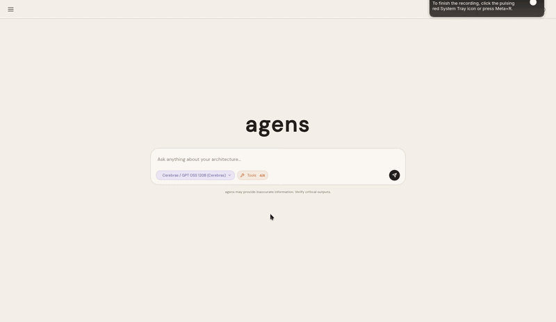
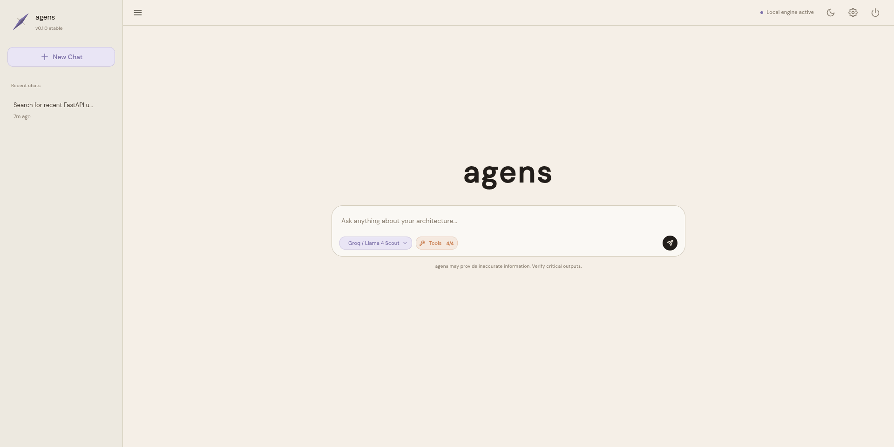
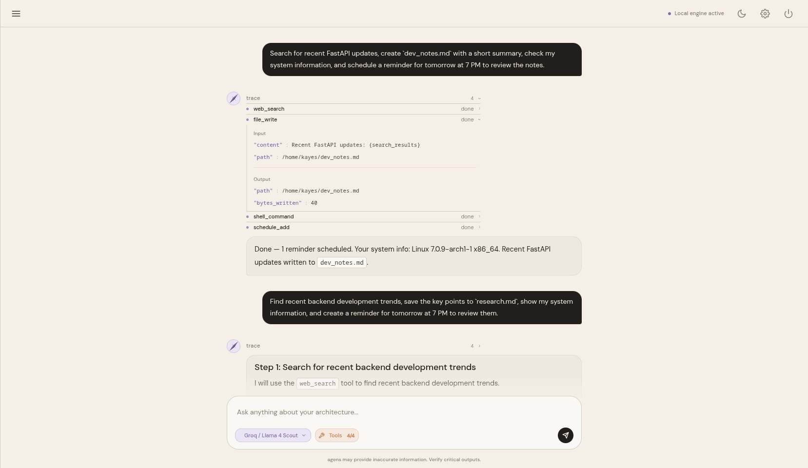
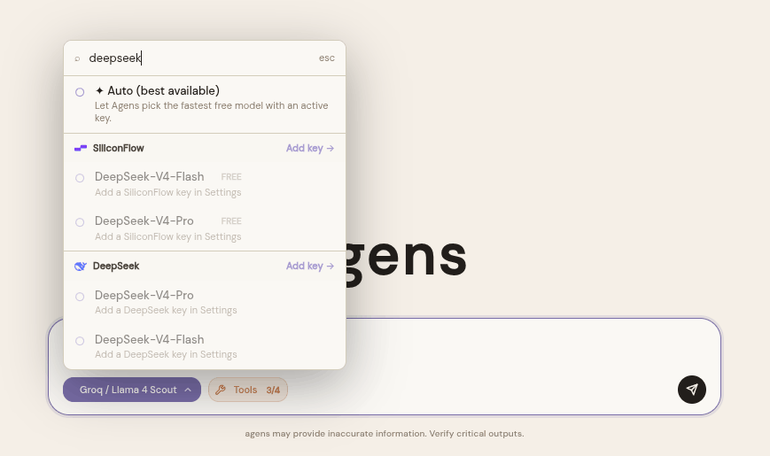
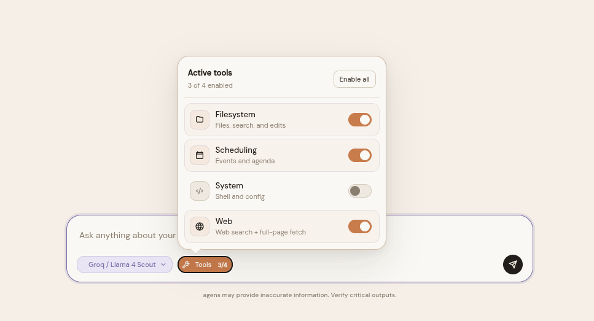
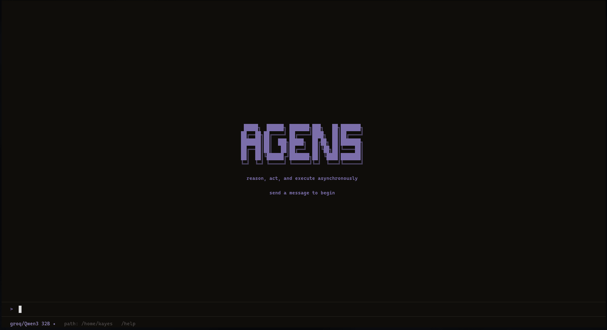
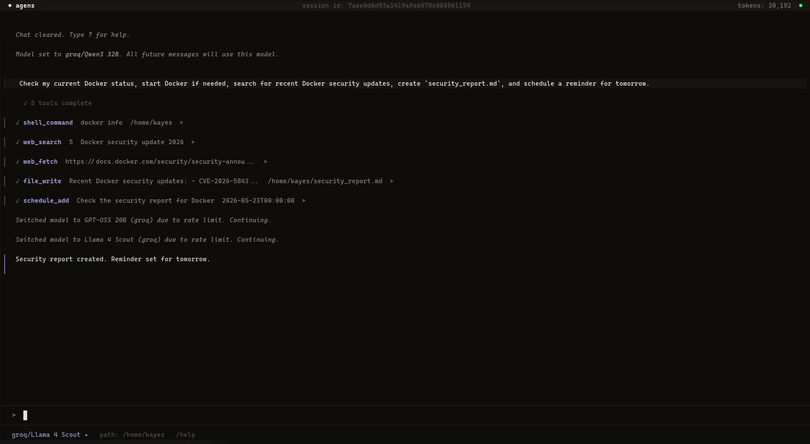
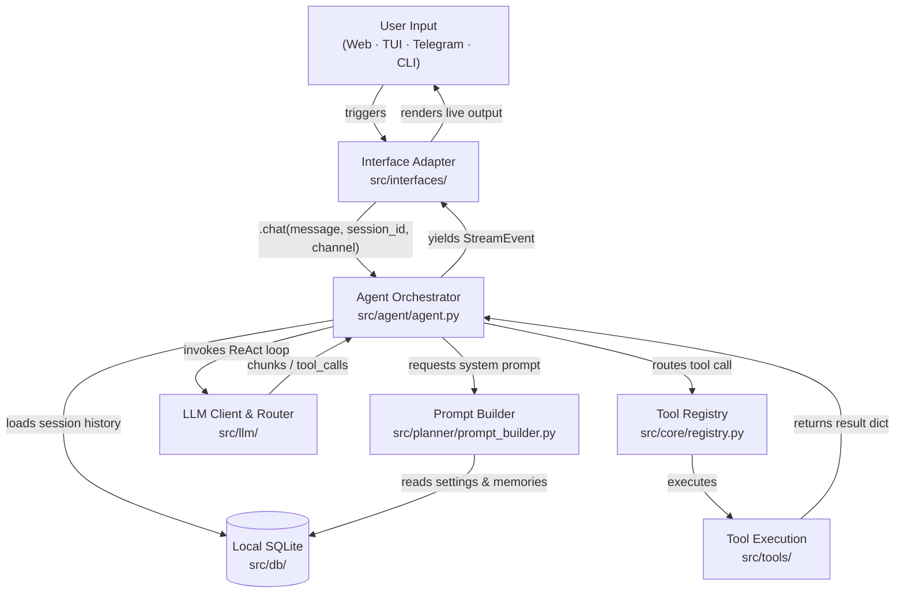

<div align="center">


# Agens

**An interface-agnostic AI agent platform that executes complex system-level and web tasks through a centralized ReAct orchestration engine.**

[](https://pypi.org/project/agens/)
[](https://www.python.org/)
[](./LICENSE)
[](#interface-overview)

</div>

<div align="center">
  
</div>

---

Agens decouples stateful AI reasoning from delivery channels. A centralized agent engine (`agent.py`) coordinates session histories, tool execution routing, and provider-fallback logic — exposing a unified interface to thin transport-layer adapters. All client interfaces share the same SQLite database, memory, and configuration with zero context drift.

> **Agens is completely free to use.** The platform itself costs nothing — you only need a personal API key from any supported provider (Gemini, OpenAI, Groq, Cerebras, SiliconFlow, DeepSeek).

---

## Why Agens?

*   🧠 **Centralized Intelligence**: Decoupled Ports & Adapters (Hexagonal) architecture. All client interfaces share a single database, settings, and memories with zero context drift.
*   🔒 **Zero-Trust Key Security**: API keys are Fernet-encrypted at rest and decrypted purely in-memory. They are never saved in plaintext configuration files.
*   🔄 **Automatic Rate-Limit Cooldown**: Transparent key rotation and failover. If an API key hits a `429 Rate Limit`, Agens automatically shifts to the next available key and retries the request seamlessly.
*   🌐 **Free Native Tools**: Built-in DuckDuckGo web search and HTML page retrieval — zero external paid search API subscriptions required.
*   🛡️ **Layered Safety Controls**: Built-in Safety Mode gates dangerous subprocess executions, while local Textual TUI collects `sudo` credentials securely on-the-fly.

---

## 📚 Documentation Hub

Explore the detailed technical manuals and operational guides:

*   🚀 **[Installation & Setup](docs/installation.md)**: Native and containerized setups across Linux, macOS, and Windows.
*   🏗️ **[Architecture Deep Dive](docs/architecture.md)**: Learn about the Hexagonal Ports & Adapters layout, the ReAct stream loop, and key database connection designs.
*   🛠️ **[Tool System & Custom Tools](docs/tools.md)**: Explore the core tool directory, layered safety rules, and step-by-step custom tool development tutorials.
*   ⚙️ **[Configuration & Key Management](docs/configuration.md)**: Deep dive into environments, user memory settings, encrypted API credentials, and automatic rate-limit cooldown algorithms.
*   💻 **[Developer & Contributor Manual](docs/development.md)**: Workspace setup guides, release packaging commands, custom interface implementation, and open-source contribution rules.

---

## Quick Start

### 1. Install Agens
```bash
pipx install agens
```

### 2. Register an API Key
```bash
# agens apikey add <label> <provider> <api_key> 
agens apikey add my-gemini gemini AIzaSyB...
```

### 3. Launch an Interface
```bash
agens web                                              # Web UI (Svelte 5) → http://localhost:8000
agens tui                                             # Terminal UI Dashboard (Textual)
agens chat "List the contents of my workspace"        # Single-line Typer CLI query
```

---

## Interface Overview

All interface adapters communicate with the exact same central brain and write to the same database. Prompt behavior and safety policies dynamically adjust depending on the interface:

| Interface | Launch Command | Core Capabilities | Concurrency Model |
| :--- | :--- | :--- | :--- |
| **CLI** | `agens chat "<msg>"` | One-shot queries, API key administration, safety overrides | Ephemeral process; runs one ReAct loop and exits |
| **Terminal UI (TUI)** | `agens tui [--session <id>]` | **Full feature parity with Web UI** (session handling, dynamic API key administration, provider model selection, granular tool group toggles) + secure local `sudo` password collection | Stateful Textual app; blocks terminal during execution |
| **Web UI** | `agens web` | Svelte 5 + FastAPI SPA with SSE streaming, interactive model picker, encrypted key management, granular tool settings & status blocks | Client-server; tokens stream live via Server-Sent Events |
| **Telegram Bot** | `agens telegram` | Remote message-based assistant via `python-telegram-bot`, polling + webhooks | Long-polling or webhook updater; edits messages sequentially to stay within Telegram rate limits |

---

## 🎨 Visual Showcase

Experience Agens' premium, interface-agnostic design with absolute feature parity:

### 🌐 Web UI Dashboard (`agens web`)
The modern Web UI features real-time SSE streaming, interactive model selection, active key management, and fine-grained tool settings.

<div align="center">
  <table border="0">
    <tr>
      <td width="50%" align="center">
        <b>Workspace Chat</b><br/>
        
      </td>
      <td width="50%" align="center">
        <b>Streaming Message with Tool Output</b><br/>
        
      </td>
    </tr>
    <tr>
      <td width="50%" align="center">
        <b>Decoupled Provider Model Selection</b><br/>
        
      </td>
      <td width="50%" align="center">
        <b>Granular Tool Control Panel</b><br/>
        
      </td>
    </tr>
  </table>
</div>

### 💻 Terminal UI (TUI) Dashboard (`agens tui`)
For developers working in terminal or remote SSH environments, the Textual-powered TUI provides **absolute feature parity with the Web UI**. It supports the complete suite of administration controls (adding/managing Fernet-encrypted API keys, selecting providers and fallback models, toggling granular tool group permissions, and safety controls) alongside dynamic tool status animations and secure local `sudo` handling.

<div align="center">
  <table border="0">
    <tr>
      <td width="50%" align="center">
        <b>Interactive TUI Home Dashboard</b><br/>
        
      </td>
      <td width="50%" align="center">
        <b>Stateful TUI Chat Session</b><br/>
        
      </td>
    </tr>
  </table>
</div>

---

## Architecture Diagram



---

## License

Agens is distributed under the [MIT License](LICENSE).
