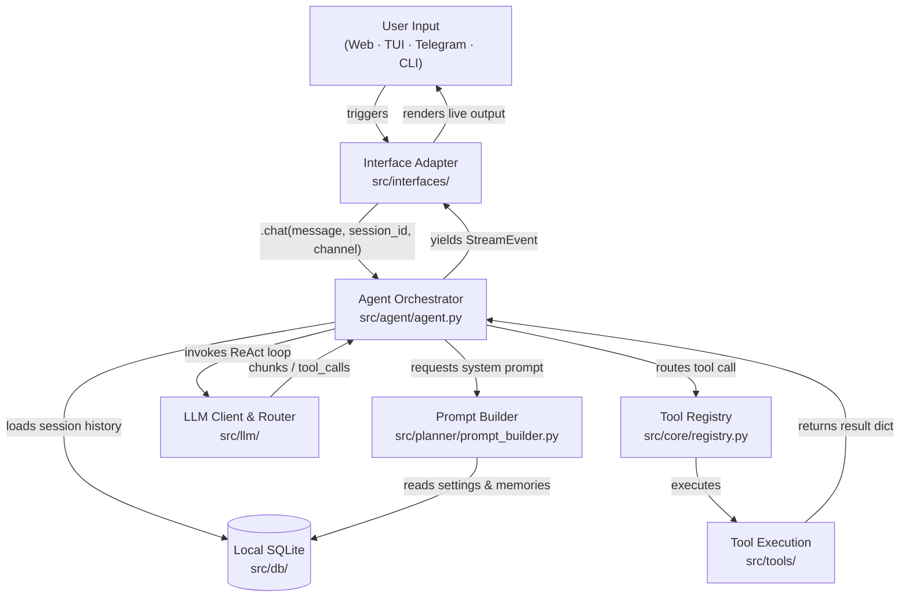

<div align="center">


# Agens

**An interface-agnostic AI agent platform that executes complex system-level and web tasks through a centralized ReAct orchestration engine.**

[](https://pypi.org/project/agens/)
[](https://www.python.org/)
[](./LICENSE)
[](#interface-overview)

[Quick Start](#quick-start) · [Installation](#installation) · [Architecture](#architecture) · [Tools](#tool-system) · [Configuration](#configuration) · [Contributing](#contributing)

</div>

---

Agens decouples stateful AI reasoning from delivery channels. A centralized agent engine (`agent.py`) coordinates session histories, tool execution routing, and provider-fallback logic — exposing a unified interface to thin transport-layer adapters. All client interfaces share the same SQLite database, memory, and configuration with zero context drift.

> **Agens is completely free to use.** The platform itself costs nothing — you only need a personal API key from any supported provider below.

| Attribute | Value |
| :--- | :--- |
| **Python** | `>=3.13` (enforced via `pyproject.toml`) |
| **Database** | SQLite via `aiosqlite` + `SQLAlchemy` |
| **Key Encryption** | `cryptography.fernet` symmetric encryption |
| **Model Providers** | Gemini, OpenAI, Groq, Cerebras, SiliconFlow, DeepSeek |
| **Dependency Manager** | `uv` / `setuptools` |
| **Interface Adapters** | CLI, Terminal UI (TUI), Web UI, Telegram Bot |

---

## Quick Start

```bash
# 1. Install
pipx install agens

# 2. Register an API key
agens apikey add my-gemini gemini AIzaSyB...

# 3. Launch an interface
agens web                                              # Web UI → http://localhost:8000
agens tui                                             # Terminal UI dashboard
agens chat "List the contents of my workspace"        # One-shot CLI query
```

### Get Your API Key

| Provider | Console / Key Page |
| :--- | :--- |
| **Gemini** | [Google AI Studio](https://aistudio.google.com/app/apikey) |
| **OpenAI** | [OpenAI Platform](https://platform.openai.com/api-keys) |
| **Groq** | [Groq Console](https://console.groq.com/keys) |
| **Cerebras** | [Cerebras Cloud](https://cloud.cerebras.ai/) |
| **SiliconFlow** | [SiliconFlow Cloud](https://cloud.siliconflow.cn/account/ak) |
| **DeepSeek** | [DeepSeek Platform](https://platform.deepseek.com/api_keys) |

---

## Interface Overview

All four adapters call the same `agent.chat()` method and read from the same SQLite database. The agent is interface-aware — safety policies and prompt behavior adapt based on the active channel.

| Interface | Launch Command | Core Capabilities | Concurrency Model |
| :--- | :--- | :--- | :--- |
| **CLI** | `agens chat "<msg>"` | One-shot queries, API key administration, safety overrides | Ephemeral process; runs one ReAct loop and exits |
| **Terminal UI (TUI)** | `agens tui [--session <id>]` | Interactive Textual dashboard, session loading, inline `sudo` password collection | Stateful Textual app; blocks terminal during execution |
| **Web UI** | `agens web` | Svelte 5 + FastAPI SPA with SSE streaming, model picker, tool status blocks | Client-server; tokens stream live via Server-Sent Events |
| **Telegram Bot** | `agens telegram` | Remote message-based assistant via `python-telegram-bot`, polling + webhooks | Long-polling or webhook updater; edits messages sequentially to stay within Telegram rate limits |

---

## Architecture

One agent brain. Four transport adapters. The architecture follows a Hexagonal (Ports & Adapters) pattern — the core domain has no knowledge of the delivery channel.



### Request Lifecycle

| Phase | What Happens | Key Module |
| :--- | :--- | :--- |
| **1 · Input** | User sends text to an interface | `interfaces/` |
| **2 · Context** | Agent loads session history from SQLite | `memory/`, `db/` |
| **3 · Prompt** | Builder assembles system prompt with tools, channel, safety mode, and memories | `planner/prompt_builder.py` |
| **4 · ReAct Loop** | LLM streams tokens or emits a tool call | `llm/`, `agent/agent.py` |
| **5 · Tool Execution** | Agent halts stream, executes tool, appends result, resumes LLM | `tools/`, `core/registry.py` |
| **6 · Persistence** | Response + tool history serialized to `messages` table | `db/` |

### Concurrency Design

- **`NullPool` connections** — SQLite does not handle concurrent pool connections under heavy async interruption. The engine is configured with `poolclass=NullPool` so each transaction provisions and tears down its own ephemeral connection. This eliminates race conditions when browser tabs close mid-stream.
- **Cancellation isolation** — `asyncio.CancelledError` from disconnected clients is caught in `agent.py`. Database finalization runs in an independent task, leaving no orphaned queries.

---

## Tool System

Tools implement `core.tool_interface.Tool` and export strict JSON schemas consumed directly by LLM function-calling APIs. Registration is explicit via `_build_registry` in `src/agent/factory.py`.

| Tool | Purpose | Destructive | Restrictions |
| :--- | :--- | :---: | :--- |
| `file_read` | Read file contents within the workspace | — | Read-only; scoped to `WORKSPACE_ROOT` |
| `file_write` | Create or overwrite files | ✓ | Scoped to `WORKSPACE_ROOT` |
| `file_edit` | Targeted string-match replacements in existing files | ✓ | Requires exact match; scoped to `WORKSPACE_ROOT` |
| `list_directory` | List files and subdirectories | — | Read-only; scoped to `WORKSPACE_ROOT` |
| `find` | Parameter-based file path search | — | Read-only; scoped to `WORKSPACE_ROOT` |
| `grep` | Pattern-match text across files | — | Read-only; scoped to `WORKSPACE_ROOT` |
| `shell_command` | Run arbitrary shell commands in a subprocess | ✓ | High-risk patterns require confirmation. Destructive commands hard-blocked. `sudo` blocked on Web + Telegram. Safety Mode ON blocks all high-risk commands everywhere. |
| `web_search` | DuckDuckGo search queries | — | Read-only |
| `web_fetch` | Download and parse raw HTML from a URL | — | Read-only |
| `update_config` | Deep-merge user memories into `config.json` | ✓ | Setting a key to `null` deletes it (memory forget) |
| `schedule_add` | Create a calendar event in the database | — | Modifies DB state |
| `schedule_list` | List registered calendar events | — | Read-only |
| `schedule_update` | Update an existing calendar event | — | Modifies DB state |
| `schedule_delete` | Permanently delete a calendar event | ✓ | Removes DB record permanently |

### Adding a New Tool

```
1. Create src/tools/your_tool.py implementing core.tool_interface.Tool
2. Define .name, .description, and a JSON Schema in .parameters
3. Implement async .execute(**kwargs) → dict
4. Register it in _build_registry() inside src/agent/factory.py
```

---

## Model & Key Management

### Provider Abstraction

All providers (`google-genai`, `openai`) implement a base interface in `llm/`. The abstraction normalizes vendor-specific exceptions into consistent internal types (`RateLimitError`, `LLMUnavailableError`) so the orchestrator never contains provider-specific error handling.

### API Key Encryption

Keys are never written to `.env` files or plaintext configs. At first boot, a `FERNET_SECRET` is generated. All keys are encrypted before DB insertion and decrypted in-memory only during active generation requests.

### Rotation & Cooldown

When a key returns a `429`:

```
APIKeyManager catches error
  → writes timestamped cooldown to api_keys.model_cooldowns (JSON)
  → rate limit:       RATE_LIMIT_COOLDOWN      default 60s
  → quota exhausted:  QUOTA_EXHAUSTED_COOLDOWN default 24h
  → queries next eligible key for same provider
  → retries generation transparently
```

### Key Management CLI

```bash
agens apikey add    <label> <provider> <api_key>   # Register a new key
agens apikey list                                   # List all registered keys
agens apikey remove <label>                         # Remove a key
agens apikey enable  <label>                        # Re-enable a disabled key
agens apikey disable <label>                        # Manually disable a key
```

---

## Safety & Authorization

The agent enforces a layered security model. Policies are injected into the LLM system prompt by `prompt_builder.py` — the model is told what it can and cannot do per channel before any user message is processed.

| Capability | CLI | TUI | Web UI | Telegram |
| :--- | :---: | :---: | :---: | :---: |
| Standard shell commands | ✓ | ✓ | ✓ | ✓ |
| High-risk commands (Safety OFF) | ✓ | ✓ | ✓ | ✓ |
| `sudo` execution (Safety OFF) | — | ✓ | — | — |
| All commands (Safety ON) | blocked | blocked | blocked | blocked |
| Windows `sudo` | — | — | — | — |

**Safety Mode** (`SAFETY_MODE_ENABLED`, default: `True`) is a hard gate — when enabled, the agent rejects all high-risk shell patterns regardless of interface. Toggle via:

```bash
agens safety on
agens safety off
```

**TUI sudo flow:** When `sudo` is permitted, the TUI suspends stream rendering and presents `SudoPasswordPrompt` — a modal widget that passes the password directly to the subprocess without logging or storing it.

---

## Installation

**Requirements:** Python `>=3.13`, Linux / macOS (Windows via WSL recommended for full shell tool support)

```bash
# Recommended — isolated global install
pipx install agens

# Upgrade
pipx upgrade agens

# Standard pip
python -m pip install agens
```

**Platform scripts:**
```bash
./scripts/install.sh install      # Linux / macOS
.\scripts\install.ps1 install     # Windows PowerShell
```

**Docker:**
```bash
docker compose up --build         # Non-root; exposes port 8000
```

---

## Configuration

Agens separates configuration across three boundaries:

### Environment (`settings.py` / `AGENS_ENV_FILE`)

| Variable | Purpose | Default |
| :--- | :--- | :--- |
| `PRODUCTION` | Restricts logging verbosity | `True` |
| `DATABASE_URL` | Path to local SQLite file | `.agens/db.sqlite` |
| `FERNET_SECRET` | Base64 key for API key encryption | Auto-generated at first boot |
| `SESSION_SECRET_KEY` | Min 32-char key for web session tokens | — |
| `WORKSPACE_ROOT` | Absolute path exposed to filesystem tools | CWD |

### User Memories (`config.json`)

The agent stores personal facts as key-value pairs under `user.memories` via the `update_config` tool:

```json
{
  "user": {
    "memories": {
      "location": "Berlin",
      "job": "backend engineer",
      "preferred_language": "Python"
    }
  }
}
```

On every request, `prompt_builder.py` injects active memories into the system prompt. To forget a memory, the agent sets its value to `null`, which the deep-merge logic prunes from the file.

### SQLite Schema

| Table | Contents |
| :--- | :--- |
| `sessions` | Session IDs and summary titles |
| `messages` | Role, content, tool call history, token usage |
| `api_keys` | Fernet-encrypted keys, hash index, hints, `model_cooldowns` JSON |
| `schedule_events` | Calendar events with recurrence rules |
| `settings` | Single-row global state (`safety_mode` toggle) |

Schema migrations are managed by Alembic and applied automatically at startup via `app_bootstrap.py`.

---

## Project Structure

```
agens/
├── frontend/                  # Svelte 5 / Vite SPA — compiles to interfaces/web/dist/
├── src/
│   ├── agens/                 # Typer CLI subcommands and entry shims
│   ├── agent/                 # ReAct orchestration loop (agent.py, factory.py)
│   ├── config/                # Pydantic-settings, ConfigManager, logging bootstrap
│   ├── core/                  # Tool base interface, schemas, ToolRegistry
│   ├── db/                    # SQLAlchemy models, aiosqlite engine, repositories
│   ├── interfaces/
│   │   ├── api/               # FastAPI routers (chat, sessions, settings, api_keys)
│   │   ├── telegram/          # python-telegram-bot handlers, polling, webhook lifecycle
│   │   ├── tui/               # Textual widgets (chat_view, command_palette, sudo_prompt)
│   │   └── web/               # FastAPI app init, static mount for Svelte dist
│   ├── llm/                   # Provider adapters (Gemini, OpenAI), fallback router
│   ├── memory/                # Conversation history aggregation for LLM injection
│   ├── planner/               # prompt_builder.py — system prompt assembly
│   ├── services/              # APIKeyManager (Fernet + rotation + cooldowns)
│   └── tools/                 # Individual tool modules
├── alembic/                   # Migration environment and versioned migration files
├── Dockerfile
├── Makefile                   # Build, dev, and frontend orchestration targets
└── pyproject.toml
```

---

## Development Workflow

```bash
# Set up the environment
uv sync

# Build the Svelte frontend (writes to src/interfaces/web/dist/)
make build-frontend

# Verify the install
uv run agens --version

# Run a specific interface locally
uv run agens tui
uv run agens web

# Build distribution wheel
make build

# Apply new DB migrations
alembic upgrade head
```

> There is no automated test suite. Local verification uses the CLI and interface launchers directly.

---

## Adding a New Interface

The Hexagonal architecture means adding a new channel (e.g., Slack, Discord) requires no changes to agent logic. Implement three connection points in a new `interfaces/<channel>/` directory:

**1. Boot lifecycle** — Register a CLI subcommand in `src/agens/main.py`:
```python
@app.command()
def slack(ctx: typer.Context):
    asyncio.run(start_slack(ctx.obj["agent"]))
```

**2. Orchestrator call** — Stream from `agent.chat()`:
```python
async for event in agent.chat(
    message=user_input,
    session_id=session_id,
    channel=Channel.SLACK
):
    # handle event
```

**3. Event rendering** — Map `StreamEvent` types to your output API:

| `event.type` | Meaning |
| :--- | :--- |
| `token` | Append text chunk to output |
| `tool_call` | Show tool execution indicator |
| `status` | Display agent status update |
| `error` | Surface error to user |
| `done` | Finalize and close stream |

---

## Contributing

Pull requests are accepted if they maintain clean separation between interface adapters and domain logic.

- **Branches:** prefix with `feature/` or `bugfix/`
- **Style:** Python 3.13 — no compatibility shims. Type annotations required.
- **PRs:** describe what changed, which files are affected, and how it was verified
- **Schema changes:** add an Alembic migration alongside any `db/models.py` change
