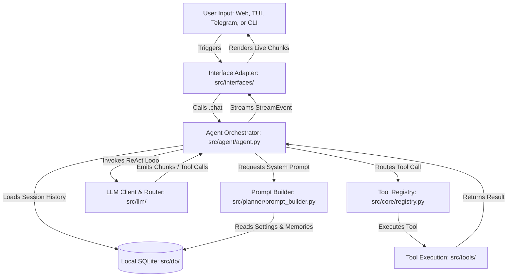

# Agens

An interface-agnostic, asynchronous AI agent platform that executes complex system-level and web tasks using a centralized ReAct orchestration engine.


| Metric / Attribute | Value |
| :--- | :--- |
| **Python Version Requirement** | `>=3.13` (enforced via `pyproject.toml`) |
| **Database** | SQLite (via `aiosqlite` and `SQLAlchemy`) |
| **Key Encryption** | Cryptography (`cryptography.fernet` symmetric encryption) |
| **Supported Model Providers** | Gemini, OpenAI, Groq, Cerebras, SiliconFlow, DeepSeek |
| **Primary Dependency Manager** | `uv` / `setuptools` |
| **Interface Adapters** | CLI, Terminal UI (TUI), Web UI, Telegram Bot |

---

## Value Proposition

Agens decouples stateful AI reasoning from delivery channels. A centralized, stateful agent engine (`agent.py`) coordinates session histories, tool execution routing, and provider-fallback logic, exposing a unified interface to thin transport-layer adapters (`interfaces/`). This architecture guarantees that all client interfaces share the exact same memories, database state, and configuration with zero context drift.

---

## Interface Overview

Agens routes all user interactions through four interface adapters, sharing centralized SQLite storage and memory configurations.

| Interface | CLI Entry / Launch Command | Core Capabilities | State & Concurrency Model |
| :--- | :--- | :--- | :--- |
| **CLI** | `agens chat "<message>"` | One-shot system queries and administrative management (API keys, safety overrides, session shutdowns). | Ephemeral process; runs a single ReAct loop and terminates. |
| **Terminal UI (TUI)** | `agens tui [--session <id>]` | Textual-based interactive console dashboard with session loading and inline `sudo` password collection. | Stateful Textual application; blocks terminal interactions during execution. |
| **Web UI** | `agens web` | Svelte 5 + FastAPI single-page application with SSE streaming, model picker, and tool execution status blocks. | Decoupled client-server model; streams tokens live via Server-Sent Events (SSE). |
| **Telegram Bot** | `agens telegram` | Remote message-based assistant powered by `python-telegram-bot`, supporting webhooks and polling. | Long-polling or webhook updater; handles edits sequentially to bypass API rate ceilings. |

---

## Architecture

The following diagram illustrates the request lifecycle, starting from client input to LLM execution, local tool resolution, and output streaming:



### Request Lifecycle Phases

1. **Input Phase:** The user provides text input to an active interface (e.g., Svelte frontend).
2. **Context Aggregation:** The interface invokes `Agent.chat(...)`. The agent instantiates a `MemoryManager` to retrieve session history from SQLite, matching the request to an active `Session` model.
3. **Prompt Formulation:** The agent requests a system prompt from `prompt_builder.py`. The builder evaluates active tool schemas, the interface channel type, and the system safety mode, injecting `user.memories` and local time data.
4. **ReAct Loop Execution:** The agent dispatches messages to the active model provider via `llm/client.py`.
   - If the LLM generates plain text tokens, the agent yields them instantly as `StreamEvent(type="token")`.
   - If the LLM emits a tool execution request, the agent halts chunk delivery, routes the call to the `ToolRegistry`, and executes the tool class.
5. **Tool Execution & Resumption:** The tool returns a dictionary payload. The agent appends this result to the prompt context, invokes the LLM client once more, and resumes streaming until a terminal completion token is received.
6. **Persistence:** The final response text and associated tool histories are serialized to JSON and persisted to the SQLite `messages` table.

### Concurrency Design Decisions
- **`NullPool` Connection Management:** SQLite does not natively support concurrent connection pools when tasks are heavily interrupted. To avoid connection leaks and transaction conflicts during active stream cancellations (e.g., a browser tab closing mid-generation), `src/db/database.py` configures the engine with `poolclass=NullPool`. Every transaction provisions and tears down an independent, ephemeral database connection.
- **Cancellation Isolation:** When a client interrupts an active streaming response, FastAPI raises an `asyncio.CancelledError`. The orchestrator handles the cancellation within `agent.py`, safely closing active SQLite transactions and cleaning up pending tasks within an independent finalization loop.

---

## Tool System

Tools are modules implementing the base class `core.tool_interface.Tool`. They export strict parameters matching JSON schemas required for function calling.

| Tool Name | Module Path | Purpose | Destructive? | Safety & Execution Constraints |
| :--- | :--- | :--- | :--- | :--- |
| `file_read` | `src/tools/file_read.py` | Reads the absolute contents of a file within the workspace. | No | Read-only; restricted to files within the designated `WORKSPACE_ROOT`. |
| `file_write` | `src/tools/file_write.py` | Overwrites or creates new files under the workspace. | Yes | Restructured to write files only under `WORKSPACE_ROOT`. |
| `file_edit` | `src/tools/file_edit.py` | Modifies existing files using precise target-matching replacements. | Yes | Requires strict string matches; restricted to `WORKSPACE_ROOT`. |
| `list_directory` | `src/tools/list_directory.py` | Lists files and subfolders within a directory. | No | Read-only; restricted to `WORKSPACE_ROOT`. |
| `find` | `src/tools/find.py` | Performs parameter-based file path searches. | No | Read-only; restricted to `WORKSPACE_ROOT`. |
| `grep` | `src/tools/grep.py` | Performs text matches across files using pattern parameters. | No | Read-only; restricted to `WORKSPACE_ROOT`. |
| `schedule_add` | `src/tools/schedule_add.py` | Creates a schedule event (meeting, calendar reminder) in the database. | No | Modifies local DB state. |
| `schedule_list` | `src/tools/schedule_list.py` | Lists registered database schedule events. | No | Read-only database query. |
| `schedule_update` | `src/tools/schedule_update.py` | Updates attributes of existing calendar events. | No | Modifies local DB state. |
| `schedule_delete` | `src/tools/schedule_delete.py` | Permanently deletes calendar events from the database. | Yes | Permanently removes records from the database. |
| `shell_command` | `src/tools/shell_command.py` | Runs arbitrary shell commands inside an isolated system subprocess. | Yes | Gated command execution. High-risk patterns (`sudo`, `su -`, `rm -rf`, `chmod 777`) require explicit confirmation. Destructive commands (`mkfs`, `dd` raw dev output, system `shutdown`/`reboot`) are hard-blocked. Windows execution does not support `sudo`. Sudo command execution is completely blocked on Web and Telegram interfaces. Safety Mode ON blocks all high-risk commands on all interfaces. |
| `update_config` | `src/tools/update_config.py` | Deep-merges user metadata and memories into `config.json`. | Yes | Modifies configurations on disk. Allows deleting key-value facts by setting their target value to `null`. |
| `web_search` | `src/tools/web_search.py` | Fetches search result pages from DuckDuckGo. | No | Read-only web query. |
| `web_fetch` | `src/tools/web_fetch.py` | Downloads and parses raw HTML text from a specific URL. | No | Read-only web page download. |

---

## Model & Key Management

### Provider Abstraction
All model integrations inherit from a base layer in `llm/`, transforming vendor-specific structures (`google-genai`, `openai`) into a standardized `LLMClient`. This abstraction translates provider exceptions (e.g., authorization failures, network timeouts) into consistent internal exceptions like `RateLimitError` or `LLMUnavailableError`.

### API Key Encryption at Rest
API keys are never stored in plaintext environment variables or configuration files. When added, keys are encrypted using symmetric `cryptography.fernet` keys generated during the first runtime boot. Plaintext keys are decrypted only in-memory during active LLM client generation requests.

### Rotation & Cooldown Mechanics
When the active API key returns a 429 Rate Limit error, the orchestrator triggers key rotation:
1. The error details are caught by the `APIKeyManager` in `services/api_key_manager.py`.
2. The manager writes a timestamped cooldown index to the SQLite database (`model_cooldowns` column) for the failing key/model combination.
3. Temporary rate-limit cooldown defaults to `RATE_LIMIT_COOLDOWN` (60s), while daily quota exhaustion triggers `QUOTA_EXHAUSTED_COOLDOWN` (24h).
4. The system queries the `APIKeyRepository` to pick the next best available key supporting the current provider or model, rotates the provider client config, and retries the generation.

### CLI Key Configuration
To register a new key, run:
```bash
agens apikey add <label> <provider> <api_key>
```
Example:
```bash
agens apikey add personal-gemini gemini AIzaSyB...
```

---

## Safety & Authorization

Agens secures the host operating system against malicious or hallucinatory shell commands through strict channel-aware and settings-based filters:

1. **Safety Mode (`SAFETY_MODE_ENABLED`):** Controlled via `settings.py` (default: `True`). When enabled, the prompt builder injects strict blocks into the system prompt, and the agent gates command execution:
   - High-risk shell commands (e.g., recursive force deletions, permission changes) are completely rejected.
   - Sudo commands are hard-blocked on all interfaces, returning an immediate error: *"Sudo is disabled while safety mode is on."*
2. **Channel-Aware Sudo Policy:** Sudo command execution is governed by the incoming client channel:
   - **Web UI & Telegram Bot:** Elevated shell commands (`sudo`) are blocked by design. The prompt builder instructs the LLM to refuse requests and return: *"Sudo commands can only be run from the TUI. Launch it with `agens tui`."*
   - **Terminal UI (TUI):** Linux/macOS sudo commands are allowed if Safety Mode is OFF. The TUI suspends normal stream rendering to display an out-of-stream password prompt modal (`SudoPasswordPrompt`), feeding the password securely to the subprocess without exposing or saving it in command logs.
3. **Platform Barriers:** Elevated command execution is completely blocked on Windows platforms. Sudo execution attempts on Windows yield: *"Privileged execution (sudo) is not supported on Windows."*

---

## Installation

### Requirements
- **Python:** `>=3.13` (enforced via `pyproject.toml`)
- **Package Manager:** `pipx` (recommended) or `pip`
- **Environment:** Linux, macOS, or Windows (WSL recommended for shell tool compatibility)
- **Containerization:** Docker & Docker Compose (optional)

### Native Installation
Deploy Agens globally within an isolated Python environment:
```bash
# Install via pipx (recommended)
pipx install agens

# Upgrade Agens
pipx upgrade agens
```

Alternatively, install using standard `pip`:
```bash
python -m pip install agens
```

### Installation Scripts
Execute local installation scripts from the workspace directory:
```bash
# Linux / macOS Bash Setup
./scripts/install.sh install

# Windows PowerShell Setup
.\scripts\install.ps1 install
```

### Docker Deployment
Build and run the production image (non-root execution, exposes port `8000`):
```bash
docker compose up --build
```

---

## Quick Start

Get a local instance running and configure a model client in three commands:

```bash
# 1. Install Agens
pipx install agens

# 2. Add your Gemini API Key
agens apikey add default-gemini gemini AIzaSyB...

# 3. Launch your preferred interface channel
agens web       # Runs the Web UI locally on http://localhost:8000
# OR
agens tui       # Launches the Terminal UI dashboard in your terminal
# OR
agens chat "List the contents of my current workspace directory"
```

---

## Configuration

Agens stores configuration and state data across three distinct boundaries:

### 1. Environment Settings (`settings.py`)
Static deployment parameters are loaded from environment variables or custom dotenv files loaded via `AGENS_ENV_FILE`.
- `PRODUCTION`: Enforces restricted logging levels (default `False`).
- `DATABASE_URL`: Path to the local SQLite database.
- `FERNET_SECRET`: Base64-encoded key used to encrypt stored API keys.
- `SESSION_SECRET_KEY`: Minimum 32-character key for securing web session tokens.
- `WORKSPACE_ROOT`: The absolute directory path exposed to file-system tools.

### 2. User & Assistant Preferences (`config.json`)
Managed dynamically by the `ConfigManager`. Extensible schema storing user attributes, tone parameters, and the Telegram bot polling token.
- **User Memories (`user.memories`):** Personal facts (e.g., university, hobby, job) are saved in a key-value index inside `config.json`.
- **Memory Injection:** On every chat request, the prompt builder extracts active memories and appends them to the system prompt: `Remembered about user: <memories>`.
- **Memory Deletion:** When a user requests that a memory be forgotten, the agent merges a config update setting the target memory key's value to `null`, pruning it from the file.

### 3. Local SQLite Database
Maintains persistent transaction states across runs:
- `sessions`: Session identifiers and summary titles.
- `messages`: Message histories, including role types, serialized tool execution contexts, and token usage records.
- `api_keys`: Fernet-encrypted keys, hashed search indexes, key hints, and active `model_cooldowns` JSON payloads.
- `schedule_events`: Calendar dates, titles, recurrence rules, and descriptions.
- `settings`: Single-row system table storing the global `safety_mode` toggle state.

---

## Project Structure

```text
agens/
├── frontend/                 # Svelte 5 / Vite SPA Web frontend
├── src/
│   ├── agens/                # CLI Typer subcommands, entry shims, and app shims
│   ├── agent/                # Central agent ReAct orchestrator loop
│   ├── config/               # Pydantic-settings, ConfigManager, and logging bootstrap
│   ├── core/                 # Tool interface definitions, schemas, and tool registries
│   ├── db/                   # SQLAlchemy models, SQLite connectors, and migrations
│   ├── interfaces/           # Thin adapters: FastAPI (web), Textual (tui), PTB (telegram)
│   ├── llm/                  # Provider client wrappers, fallback router, and catalogs
│   ├── memory/               # Conversation history managers
│   ├── planner/              # prompt_builder (system prompt assembly & memory injection)
│   ├── services/             # Fernet cryptographic API key & settings services
│   └── tools/                # Extensible filesystem, calendar, shell, and web tools
├── Dockerfile                # Production container deployment
├── Makefile                  # Build and dev orchestration targets
└── pyproject.toml            # Package configuration and dependency requirements
```

---

## Development Workflow

### Developer Setup
Initialize a local development environment:
```bash
# 1. Sync virtual environment and download dependencies
uv sync

# 2. Build the Svelte static frontend assets
make build-frontend

# 3. Verify the installation
uv run agens --version
```

### Build & Package
Prepare distribution wheels:
```bash
make build
```
*Note: The frontend build step writes static packages to `src/interfaces/web/dist` before wheels are built.*

### Code Quality and Testing
- **Testing Constraints:** There is no automated `pytest` test suite configured in this repository. Local verification must be conducted manually using the unified CLI and temporary execution scripts (e.g., `test.py`).
- **Database Migrations:** Database schema updates must be registered within `src/db/models.py`. Generate a new migration file via the Alembic CLI. Migrations are automatically applied to the local SQLite database at runtime startup via `app_bootstrap.py`.

### How to Add a New Tool
1. Create a new tool class implementing `core.tool_interface.Tool` within `src/tools/`.
2. Define `.name`, `.description`, and a valid JSON Schema in `.parameters`.
3. Implement `.execute(**kwargs)` (asynchronous or synchronous block).
4. Explicitly import and register your tool within `_build_registry` in `src/agent/factory.py`.

---

## Adding a New Interface

The Hexagonal architecture decouples transport layers from the central brain. Adding a new interaction channel (e.g., Slack, Discord) requires no changes to the agent logic. Implement three steps in a new interface adapter:

1. **Boot Lifecycle:** Bind the interface's main execution loop under a new command CLI subcommand inside `src/agens/main.py`.
2. **Orchestrator Invocation:** Retrieve the agent instance and call the `.chat()` async streaming generator:
   ```python
   async for event in agent.chat(
       message=user_input,
       session_id=session_id,
       channel=Channel.MY_CHANNEL
   ):
       # Process stream events
   ```
3. **Event Rendering:** Map incoming `StreamEvent` payload types (`token`, `status`, `tool_call`, `error`, `done`) to the interface's rendering output API.

---

## Contributing

We accept pull requests that align with our codebase architecture.
- **Branch Conventions:** Work must be conducted in dedicated branches prefixed with `feature/` or `bugfix/`.
- **Formatting Guidelines:** Code must strictly comply with Python 3.13 constructs. Ensure that clean separation of interface adapters from domain layers is maintained.
- **Pull Requests:** PR descriptions must concisely outline changes, file impacts, and testing verifications.

---

<!-- DOCUMENTATION GAPS -->
<!--
The following inconsistencies, omissions, and stale sections in the codebase require maintenance:

1. **Notification System Scope Mismatch:**
   - Problem: `PROJECT_OVERVIEW.md` describes a "configurable notification framework... durable notification history, per-session subscription preferences, and channel-specific formatting."
   - Reality: The repository contains no database tables for notifications, no `NotificationService` server-side class, and no session-based subscription preferences. Notifications are completely ephemeral: handled client-side using the browser Notification API (`ChatArea.svelte`) and inline edits in Telegram message handlers (`handlers.py`).

2. **Missing Seeded Discord Adapter Directory:**
   - Problem: `PROJECT_OVERVIEW.md` states "The discord/ directory being seeded but empty should be noted as planned." Additionally, `src/config/runtime.py` references "discord" in its example docstring.
   - Reality: No `discord/` folder exists under `src/interfaces/` in the codebase.

3. **Stale Testing Documentation:**
   - Problem: Running tests is mentioned in architectural overviews.
   - Reality: No automated `tests/` directory or `pytest` configs are declared in the codebase or dependencies.
-->
