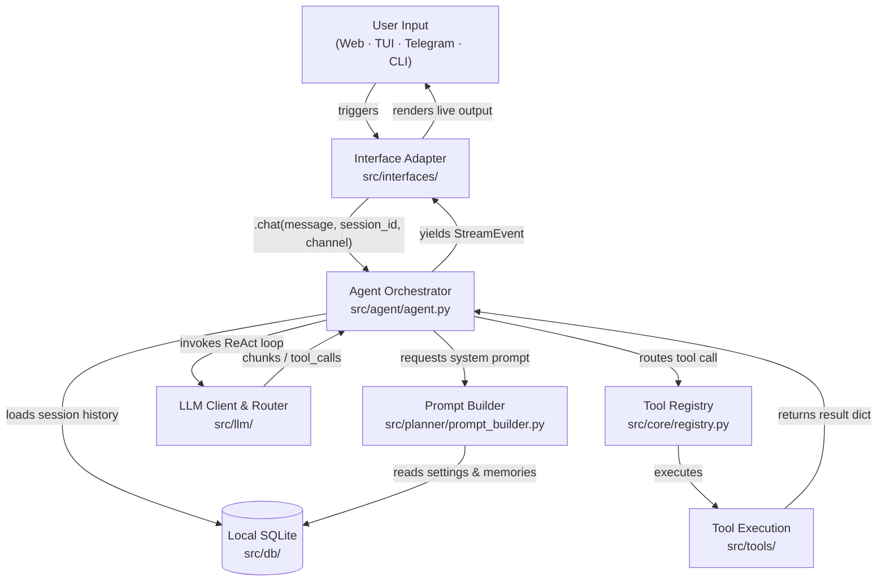

<div align="center">


# Agens

**A completely free, interface-agnostic AI agent platform that executes system and web tasks through a centralized ReAct orchestration engine.**

[](https://pypi.org/project/agens/)
[](https://www.python.org/)
[](https://github.com/kayesFerdous/agens/blob/main/LICENSE)
[](#interface-overview)

</div>

<div align="center">
  
</div>

---

Agens is a completely **free** AI agent platform. I built this project so that **anyone can have a taste of an AI assistant completely for free, without having to spend a single penny.** Every part of it—from the ReAct engine (`agent.py`) and interface adapters to the encrypted key management and SQLite database—is set up to make this experience smooth and easy.

To make sure it is accessible, reliable, and smooth for everyone, Agens is built with three simple rules:
*   🌱 **Easy for Anyone**: You don't need to be a developer or have a technical background to use Agens. Getting started takes just a single command, and adding your API keys is fully visual and straightforward—no coding or configuration files required.
*   🔄 **On-the-go Model & Key Failover**: Free API keys often hit rate limits. If you hit a `429 Rate Limit` while the agent is answering, it automatically rotates to your next key, provider, or fallback model on the go. It resumes the active task right where it left off, so you don't face interruptions.
*   ⚡ **Low Token Usage**: Designed to use as few tokens as possible to help stay within free-tier limits. It only loads instructions for the tools you have turned on, keeps conversation history short and pruned, and avoids unnecessary prompt bloat.

---

## Why Agens?

*   🧠 **All Interfaces in One Place**: All client interfaces share the same database, settings, and memories so you can switch between them without losing track of your chat.
*   🔒 **Secure Key Storage**: API keys are encrypted at rest and decrypted only in-memory. They are never saved in plaintext files.
*   🔄 **Automatic Failover**: If an API key hits a rate limit, Agens automatically shifts to the next available key or provider on the fly to finish the task.
*   ⚡ **Efficient Token Usage**: Keeps prompts short and history pruned to save your free-tier quota.
*   🌐 **Free Native Tools**: Built-in DuckDuckGo web search and web page reading with no paid search API keys needed.
*   🛡️ **Safety Mode**: An optional safety mode to prevent accidental changes to your system.

---

## 📚 Documentation Hub

Explore the detailed technical manuals and operational guides:

*   🚀 **[Installation & Setup](https://github.com/kayesFerdous/agens/blob/main/docs/installation.md)**: Native and containerized setups across Linux, macOS, and Windows.
*   🏗️ **[Architecture Deep Dive](https://github.com/kayesFerdous/agens/blob/main/docs/architecture.md)**: Learn about the Hexagonal Ports & Adapters layout, the ReAct stream loop, and key database connection designs.
*   🛠️ **[Tool System & Custom Tools](https://github.com/kayesFerdous/agens/blob/main/docs/tools.md)**: Explore the core tool directory, layered safety rules, and step-by-step custom tool development tutorials.
*   ⚙️ **[Configuration & Key Management](https://github.com/kayesFerdous/agens/blob/main/docs/configuration.md)**: Deep dive into environments, user memory settings, encrypted API credentials, and automatic rate-limit cooldown algorithms.
*   💻 **[Developer & Contributor Manual](https://github.com/kayesFerdous/agens/blob/main/docs/development.md)**: Workspace setup guides, release packaging commands, custom interface implementation, and open-source contribution rules.

---

## Quick Start

### 1. Install Agens
```bash
pipx install agens
```

### 2. Register an API Key
You can register your keys through the CLI:
```bash
# agens apikey add <label> <provider> <api_key> 
agens apikey add my-gemini gemini AIzaSyB...
```
*Tip: Alternatively, you can launch the Web UI or Terminal UI first (Step 3) and add your keys visually through the settings dashboard.*

### 3. Launch an Interface
```bash
agens web                                              # Web UI (Svelte 5) → http://localhost:8000
agens tui                                             # Terminal UI Dashboard (Textual)
agens chat "List the contents of my workspace"        # Single-line Typer CLI query
```

---

## Interface Overview

All interface adapters communicate with the exact same central brain and write to the same database. Prompt behavior and safety policies dynamically adjust depending on the interface:

| Interface | Launch Command | Core Capabilities | Concurrency Model |
| :--- | :--- | :--- | :--- |
| **CLI** | `agens chat "<msg>"` | One-shot queries, API key administration, safety overrides | Ephemeral process; runs one ReAct loop and exits |
| **Terminal UI (TUI)** | `agens tui [--session <id>]` | **Full feature parity with Web UI** (session handling, dynamic API key administration, provider model selection, granular tool group toggles) + secure local `sudo` password collection | Stateful Textual app; blocks terminal during execution |
| **Web UI** | `agens web` | Svelte 5 + FastAPI SPA with SSE streaming, interactive model picker, encrypted key management, granular tool settings & status blocks | Client-server; tokens stream live via Server-Sent Events |
| **Telegram Bot** | `agens telegram` | Remote message-based assistant via `python-telegram-bot`, polling + webhooks | Long-polling or webhook updater; edits messages sequentially to stay within Telegram rate limits |

---

## 🎨 Visual Showcase

Experience Agens' premium, interface-agnostic design with absolute feature parity:

### 🌐 Web UI Dashboard (`agens web`)
The modern Web UI features real-time SSE streaming, interactive model selection, active key management, and fine-grained tool settings.

<div align="center">
  <table border="0">
    <tr>
      <td width="50%" align="center">
        <b>Workspace Chat</b><br/>
        
      </td>
      <td width="50%" align="center">
        <b>Streaming Message with Tool Output</b><br/>
        
      </td>
    </tr>
    <tr>
      <td width="50%" align="center">
        <b>Decoupled Provider Model Selection</b><br/>
        
      </td>
      <td width="50%" align="center">
        <b>Granular Tool Control Panel</b><br/>
        
      </td>
    </tr>
  </table>
</div>

### 💻 Terminal UI (TUI) Dashboard (`agens tui`)
For developers working in terminal or remote SSH environments, the Textual-powered TUI provides **absolute feature parity with the Web UI**. It supports the complete suite of administration controls (adding/managing Fernet-encrypted API keys, selecting providers and fallback models, toggling granular tool group permissions, and safety controls) alongside dynamic tool status animations and secure local `sudo` handling.

<div align="center">
  <table border="0">
    <tr>
      <td width="50%" align="center">
        <b>Interactive TUI Home Dashboard</b><br/>
        
      </td>
      <td width="50%" align="center">
        <b>Stateful TUI Chat Session</b><br/>
        
      </td>
    </tr>
  </table>
</div>

---

## Architecture Diagram



---

## License

Agens is distributed under the [MIT License](https://github.com/kayesFerdous/agens/blob/main/LICENSE).
