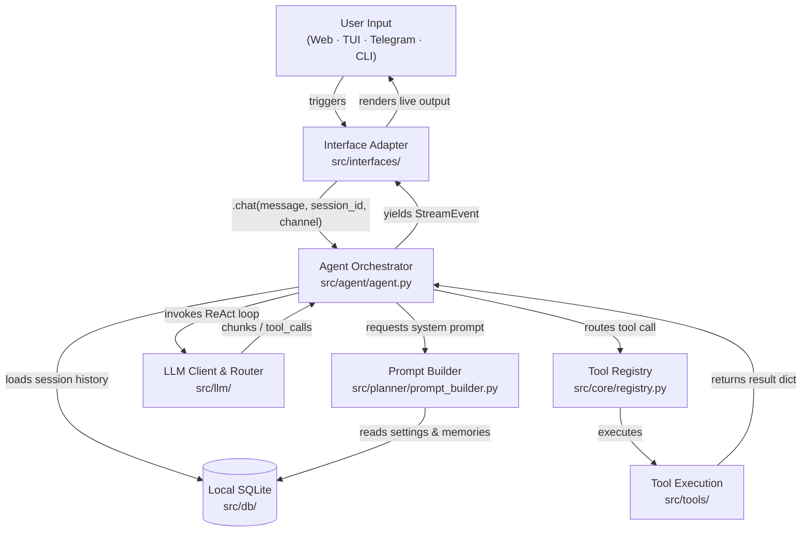

<div align="center">


# Agens

**Your free, multi-platform AI assistant. Any interface. Zero cost. Runs where you do. 🚀**

[](https://pypi.org/project/agens/)
[](https://www.python.org/)
[](./LICENSE)
[](#-docs-by-goal)

</div>

<div align="center">
  
</div>

---

Agens is a completely **free** AI assistant designed to let anyone experience the power of AI without spending a single penny. It is built to run entirely on your own devices (or in the cloud) and connects one smart, central brain to all the interfaces you already use: a modern Web dashboard, a sleek Terminal UI, quick command-line chats, or a Telegram bot. 

I built this project to make setting up and running your own personal assistant simple and completely hassle-free—no coding, configuration file editing, or subscription fees required.

---

## ⚡ Quick Install

Get up and running in a single command:

### Linux, macOS, WSL2, Termux
```bash
curl -fsSL https://raw.githubusercontent.com/kayesFerdous/agens/main/scripts/install.sh | bash
```

### Windows (PowerShell)
```powershell
irm https://raw.githubusercontent.com/kayesFerdous/agens/main/scripts/install.ps1 | iex
```

*Note: The installer automatically takes care of environment setups, installing any missing tools, and gets Agens ready for your first chat.*

---

## 🧠 Why Agens?

<table>
<tr><td><b>Always Free & Low Token Cost</b></td><td>Built specifically to help you stay within free-tier API limits. Agens keeps conversation histories short, prunes prompt bloat, and only loads tools you actively turn on.</td></tr>
<tr><td><b>Auto-Recover Rate Limits</b></td><td>Free keys hit rate limits often. If your key hits a rate limit while Agens is answering, it instantly rotates to your next key, provider, or fallback model in-flight so your task finishes seamlessly.</td></tr>
<tr><td><b>One Brain, Any Interface</b></td><td>Switch between the Web dashboard, Terminal UI, quick command-line chats, or a Telegram bot. They all share the same memory, databases, and settings.</td></tr>
<tr><td><b>Safe Command Execution</b></td><td>Agens can run shell commands, write files, and do web lookups. A built-in Safety Mode blocks harmful commands automatically, and it securely collects passwords for root commands locally.</td></tr>
<tr><td><b>Secure By Default</b></td><td>Your API keys are encrypted at rest using industry-grade cryptography. They are decrypted only in memory during active runs and are never stored in plaintext files.</td></tr>
<tr><td><b>Free Live Web Searching</b></td><td>Comes with built-in web search and page reading tools. No paid search API subscriptions required—look up facts and read live URLs completely for free.</td></tr>
</table>

---

## 🔒 Security & Safety Defaults

Agens is highly capable and can run shell commands or manage files in your workspace. To keep your system safe, we build security in by default:

*   **Safety Mode**: Hard-blocks dangerous shell command families (such as recursive deletes on system folders or editing core OS files) and dangerous command-chaining.
*   **Interface-Aware Sudo Policies**:
    *   **Terminal UI (Trusted)**: If a command needs `sudo` access, the TUI pauses the output and displays a secure popup to collect your password, passing it directly to the system subprocess without ever saving it.
    *   **Web & Telegram (Untrusted)**: All `sudo` executions are **hard-blocked** on remote or web channels to prevent security exploits.

---

## 💻 Operator Quick Reference

Manage keys, safety modes, and environments easily from your terminal:

| Category | Action | CLI Command |
| :--- | :--- | :--- |
| **Run Interfaces** | Start Web Dashboard | `agens web` |
| | Start Terminal UI | `agens tui` |
| | Chat via Command Line | `agens chat "your prompt"` |
| | Launch Telegram Listener | `agens telegram` |
| **API Key Manager** | Add and Encrypt Key | `agens apikey add <label> <provider> <key>` |
| | List Active Keys | `agens apikey list` |
| | Temporarily Disable Key | `agens apikey disable <label>` |
| | Enable Disabled Key | `agens apikey enable <label>` |
| | Permanently Remove Key | `agens apikey remove <label>` |
| **Safety Controls** | Turn Safety Mode ON | `agens safety on` |
| | Turn Safety Mode OFF | `agens safety off` |
| **Daemon Control** | List Running Interfaces | `agens interfaces` |
| | Stop All Running Interfaces | `agens shutdown` |

---

## 📚 Docs by Goal

Find exactly what you need based on what you are trying to achieve:

*   🚀 **[First-Time Setup](docs/installation.md)**: Detailed native, script-based, and containerized (Docker) setup steps across all operating systems.
*   ⚙️ **[Platform & Key Configuration](docs/configuration.md)**: How encrypted credentials work, setting up automatic failover models, long-term memory configurations, and token optimizations.
*   🛠️ **[Custom Tools & Extensions](docs/tools.md)**: List of built-in file and web tools, and a simple step-by-step tutorial on writing your own custom tools in Python.
*   💻 **[Developer Loop & Contributions](docs/development.md)**: Setting up a local workspace, building Vite/Svelte 5 assets, compiling release wheels, and database migrations.
*   🏗️ **[Under the Hood](docs/architecture.md)**: Architectural deep dive into ports & adapters layout, SQLite connection concurrency, and event loop cancellation protections.

---

## 🎨 Visual Showcase

All interfaces write to the exact same database. Explore the premium, feature-parity interfaces:

### Web Dashboard (`agens web`)
Features real-time SSE streaming, interactive model pickers, encrypted key managers, and granular tool controls.

<div align="center">
  <table border="0">
    <tr>
      <td width="50%" align="center">
        <b>Workspace Chat</b><br/>
        
      </td>
      <td width="50%" align="center">
        <b>Streaming Message with Tool Output</b><br/>
        
      </td>
    </tr>
    <tr>
      <td width="50%" align="center">
        <b>Decoupled Provider Model Selection</b><br/>
        
      </td>
      <td width="50%" align="center">
        <b>Granular Tool Control Panel</b><br/>
        
      </td>
    </tr>
  </table>
</div>

### Terminal UI Dashboard (`agens tui`)
Designed for developers working in terminal or remote SSH environments, offering full parity with the Web UI.

<div align="center">
  <table border="0">
    <tr>
      <td width="50%" align="center">
        <b>Interactive TUI Home Dashboard</b><br/>
        
      </td>
      <td width="50%" align="center">
        <b>Stateful TUI Chat Session</b><br/>
        
      </td>
    </tr>
  </table>
</div>

---

## 🏗️ Architecture Design



---

## 📄 License

Agens is distributed under the [MIT License](LICENSE).
