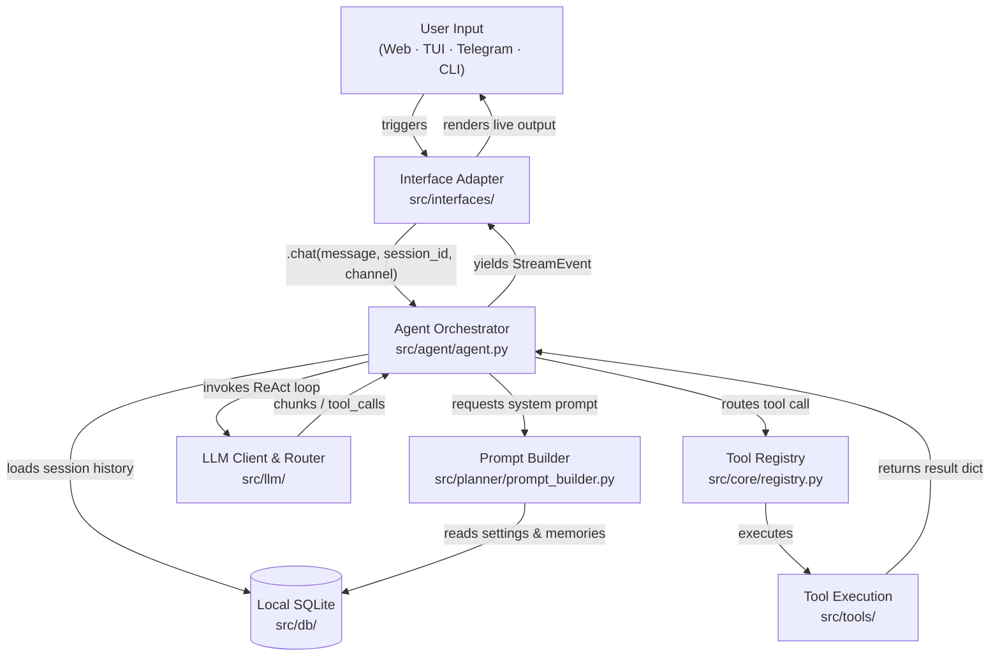

# Architecture Deep Dive

Agens decouples stateful AI reasoning from delivery channels. The platform follows the **Hexagonal Architecture (Ports and Adapters)** pattern — the core domain has no direct knowledge of the transport interfaces.

---

## Architectural Layout

### 1. Core Domain Layer
Located under `src/db/models.py` and `src/core/types.py`. This layer represents the fundamental entities of the application (Sessions, Messages, and Tool Results). It has zero dependencies on any external APIs or delivery protocols.

### 2. Service Layer
Represented by `src/agent/agent.py`, `src/services/`, and `src/planner/`. This layer coordinates application workflows: assembling user system prompts, fetching chat context, managing key cooldown timers, and decrypting API keys.

### 3. Adapter Layer (Input Ports)
Located in `src/interfaces/web/`, `src/interfaces/telegram/`, and `src/interfaces/tui/`. These modules are lightweight "delivery adapters." They capture channel-specific inputs and translate them into a uniform orchestrator invocation via `Agent.chat(message=..., session_id=..., channel=...)`.

### 4. Adapter Layer (Output Ports)
Located in `src/tools/`. These modules handle side effects on the hosting platform (filesystem CRUD, web searches, raw HTML downloads, subprocess shell command execution).

---

## The Request Lifecycle

When a user submits a query to Agens, the system guides the payload through a structured async ReAct execution cycle:

| Phase | What Happens | Key Module |
| :--- | :--- | :--- |
| **1 · Input** | User inputs a prompt via Svelte Web, Textual TUI, Telegram, or the Typer CLI | `src/interfaces/` |
| **2 · Context** | The orchestrator queries the database repository to gather recent chat messages for context | `src/memory/`, `src/db/` |
| **3 · Prompt** | `PromptBuilder` merges dynamic settings, user memories, tool JSON schemas, and channel safety policies into a system prompt | `src/planner/prompt_builder.py` |
| **4 · ReAct Loop** | The model streams tokens or issues a tool execution request (yielding `StreamEvent` packets) | `src/llm/`, `src/agent/agent.py` |
| **5 · Tool Execution** | The orchestrator halts the generation stream, performs the target tool execution, aggregates the result, and feeds it back to the LLM | `src/tools/`, `src/core/registry.py` |
| **6 · Persistence** | The completed assistant answer along with all intermediate tool invocations are serialized back to the SQLite DB | `src/db/` |

---

## Concurrency & Resiliency Design

Running complex, async ReAct loops on SQLite with multiple potentially interrupted frontends presents unique race condition risks. Agens addresses these with two specific design choices:

### NullPool Connections
Standard SQLAlchemy connection pools keep background connections open. In an asynchronous environment like a FastAPI app with active SSE streams, SQLite can experience write locks (`database is locked` errors). To mitigate this, Agens utilizes `poolclass=NullPool`. 

Every database transaction provisions and tears down its own ephemeral connection. While this adds a tiny connection overhead, it completely eliminates race conditions when multiple client connections are made or disconnected simultaneously.

### Graceful Cancellation Isolation
When a web browser tab is closed mid-stream, or a client terminates a connection, the asyncio event loop raises an `asyncio.CancelledError`. If this happens during a database write or while final session summaries are being generated, it can leave the database in an inconsistent state.

To prevent this:
1. `agent.py` catches `asyncio.CancelledError` internally.
2. It delegates database cleanups and session status updates to an independent task running outside the main cancellation context (`asyncio.create_task()`).
3. This guarantees that SQLite databases are safely closed and no orphaned sessions are left in the database.

---

## Navigation

- 🏠 **[Home (README)](../README.md)**
- 🚀 **[Installation & Setup](installation.md)**
- 🛠️ **[Tool System & Custom Tools](tools.md)**
- ⚙️ **[Configuration & Key Management](configuration.md)**
- 💻 **[Developer & Contributor Manual](development.md)**
