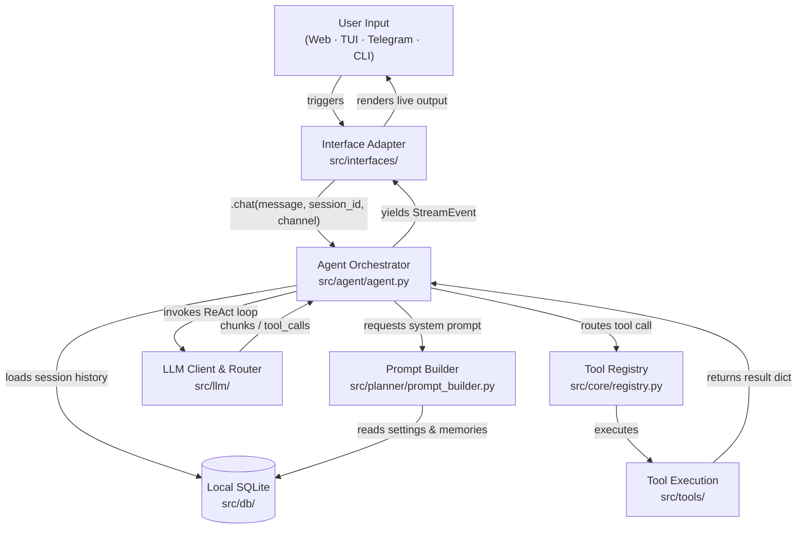

# Architecture Deep Dive

[Home (README)](../README.md) · [Installation & Setup](installation.md) · [Tool System](tools.md) · [Configuration](configuration.md) · [Developer Manual](development.md)

---

Agens is built to run smoothly, safely, and fast. To help you understand what is happening under the hood, we describe our design below using simple, real-world analogies.

---

## 🏗️ The "Universal Adapter" Design (Hexagonal Layout)

Think of Agens as a high-quality **universal adapter plug**. The core brain handles the hard thinking, memory, and database writes. The interfaces (Web UI, TUI, CLI, and Telegram) are just custom plugs that slide onto the adapter. 

Because we keep them completely separated:
*   The brain does not care if you are chatting on Telegram or in your command line. It processes information the exact same way.
*   You can design and slide on a new platform plug (like Discord or Slack) without modifying a single line of code in the core brain.

---

## 🔄 The Request Lifecycle

When you ask Agens a question, your message travels through a simple 6-stage lifecycle:

| Phase | What Happens | Where it happens |
| :--- | :--- | :--- |
| **1. Input** | You type a message into Svelte Web, TUI, Telegram, or the CLI. | `src/interfaces/` |
| **2. Context** | The orchestrator queries the SQLite database to fetch your recent chat history. | `src/db/` |
| **3. Prompt** | `PromptBuilder` merges your database settings, long-term memories, and active tools into system instructions. | `src/planner/prompt_builder.py` |
| **4. Think Loop** | The AI decides if it needs a tool, yielding stream updates to your screen in real time. | `src/agent/agent.py` |
| **5. Tool Run** | If the AI wants to run a tool (like search the web), Agens pauses the text, runs the tool, and feeds the results back to the AI. | `src/tools/` |
| **6. Save** | The final answer and all the intermediate tool runs are saved securely to the SQLite database. | `src/db/` |

---

## 🔒 Concurrency & Resiliency Design

Running multiple interfaces (like having the Web dashboard open while running a command-line chat) on a local database presents unique challenges. Agens is built to survive these scenarios.

### Ephemeral Database Lines (NullPool)
*   **The Problem**: Standard databases keep connection lines open to speed things up. But if you open multiple browser tabs at once, SQLite can lock up and crash (`database is locked` error).
*   **Our Solution**: Agens uses an active **NullPool** connection manager. Every single read or write transaction opens its own fresh connection line, performs the fast update, and instantly closes it. While this adds a microscopic overhead, it completely eliminates database lock crashes.

### Closing Tabs Safely (Cancellation Isolation)
*   **The Problem**: If you close your web browser tab mid-sentence while the AI is writing to the database, standard systems can halt abruptly, leading to database corruption or incomplete chat histories.
*   **Our Solution**: Agens watches for event loop cancellations. If a cancellation occurs, the engine isolates database cleanups and status saves into a protected background task. This guarantees that your local database is shut down cleanly and no broken data is left behind.

---

## Navigation

- 🏠 **[Home (README)](../README.md)**
- 🚀 **[Installation & Setup](installation.md)**
- 🛠️ **[Tool System & Custom Tools](tools.md)**
- ⚙️ **[Configuration & Key Management](configuration.md)**
- 💻 **[Developer & Contributor Manual](development.md)**
