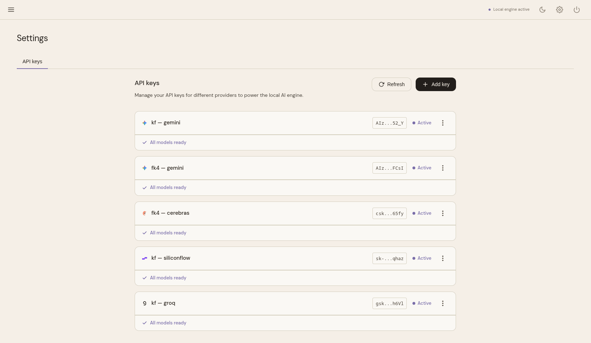
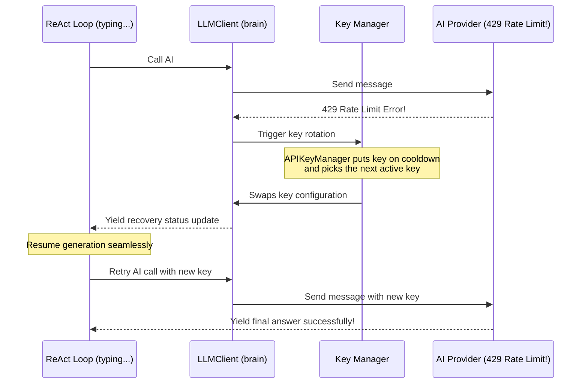

# Configuration & Key Management

[Home (README)](../README.md) · [Architecture Deep Dive](architecture.md) · [Installation & Setup](installation.md) · [Tool System](tools.md) · [Developer Manual](development.md)

---

Agens keeps its configurations clean, organized, and secure across three simple boundaries:
1. **System Variables**: Low-level engine preferences (set in your terminal or a `.env` file).
2. **API Keys**: Encrypted third-party keys (stored safely in your database).
3. **User Memories**: Custom facts about you (stored in a simple settings file).

---

## 1. System Variables

Low-level settings are parsed automatically from environment variables or an `agens.env` file. You normally do not need to touch these unless you want to customize ports or folders:

| Variable | What it does | Default Value |
| :--- | :--- | :--- |
| `PRODUCTION` | Disables verbose debug logging for maximum speed | `True` |
| `DATABASE_URL` | The location of your local SQLite database file | `.agens/db.sqlite` |
| `FERNET_SECRET` | The master key used to lock and unlock your API keys | Auto-generated on first run |
| `SESSION_SECRET_KEY` | Hex key to secure your Web UI dashboard cookies | Auto-generated on first run |
| `WORKSPACE_ROOT` | The folder Agens is allowed to edit (prevents file escaping) | Current folder (CWD) |
| `WEB_HOST` | The network address the web dashboard runs on | `0.0.0.0` (any address) |
| `WEB_PORT` | The port the web dashboard listens on | `8000` |

> [!TIP]
> **Changing the Port**: If port `8000` is already taken, you can run the web dashboard on a different port (e.g. `8080`) easily via the CLI:
> ```bash
> agens web --port 8080
> ```

---

## 2. Cryptographic API Key Management

Your API keys (for Gemini, OpenAI, DeepSeek, etc.) are treated with maximum security. Agens **never** writes your keys in plaintext inside config files or logs.

### Encryption at Rest
1. On your very first run, Agens creates a strong, unique `FERNET_SECRET` master key.
2. When you add a new API key, it is encrypted using industry-standard symmetric encryption before saving it to your SQLite database.
3. The keys are decrypted **exclusively in your computer's temporary memory** when sending a request to the AI provider. They are never exposed.

### Quick Key Administration CLI
You can manage all your keys easily in your terminal:
```bash
agens apikey add    <label> <provider> <api_key>   # Register and encrypt a new key
agens apikey list                                   # See hints of all registered keys
agens apikey disable <label>                        # Temporarily pause a key from being used
agens apikey enable  <label>                        # Unpause a key
agens apikey remove <label>                         # Permanently delete a key
```

Alternatively, you can manage keys visually in the Web dashboard Settings tab:

<div align="center">
  
</div>

---

## 3. In-Flight Key Rotation & Cooldowns

Free API keys hit rate limits often. Agens is built specifically to handle rate limits in-flight without interrupting your chat.

If your active API key hits a `429 Rate Limit` while typing:
1. **Cooldown Trigger**: Agens automatically intercepts the error and flags the specific key as "resting" (60 seconds for normal limits, 24 hours for quota exhaustion).
2. **In-Flight Recovery**: Instead of throwing an error and making you restart your task, the brain swaps in your next available key or switches to a fallback model **on the fly**.
3. **Seamless Resume**: It immediately retries the exact step, keeping all conversation context intact, giving you a smooth, uninterrupted experience.



---

## 4. Persistent User Memories

Traditional chatbots forget everything about you the second you close the tab. Agens solves this by storing permanent facts about you in a small local file called `config.json`.

### How Memories are Saved
If you say *"Remember that I write Python code"*, Agens runs a built-in memory tool that updates `config.json`:
```json
{
  "user": {
    "memories": {
      "coding_style": "Python",
      "specialty": "FastAPI and Svelte"
    }
  }
}
```

### Prompt Injection
Every single time you start a new conversation, Agens reads these memories and injects them directly into the system instructions, ensuring the AI always remembers your preferences.

### Forgetting Facts
If you tell it to *"Forget my coding specialty"*, Agens updates the key to `null`, instantly pruning and removing the fact from `config.json`.

---

## 5. Token Optimization (Saving Your Limits)

To help you get the most out of free-tier accounts, Agens keeps its token footprint extremely small:

1. **Compact Chat Histories**: Agens only retrieves the last **3** messages as history. This prevents the conversation context from growing exponentially as you talk, keeping token usage at an absolute minimum.
2. **Modular Tools**: Rather than stuffing every single tool instruction into every prompt, Agens checks which tools you have turned ON. It only loads instructions for active tool families, saving hundreds of tokens per turn.
3. **No Polite Fluff**: Agens commands the AI model to skip greetings, introductions, and polite filler words, getting straight to the point. This saves both output tokens and loading time.

---

## Navigation

- 🏠 **[Home (README)](../README.md)**
- 🚀 **[Installation & Setup](installation.md)**
- 🏗️ **[Architecture Deep Dive](architecture.md)**
- 🛠️ **[Tool System & Custom Tools](tools.md)**
- 💻 **[Developer & Contributor Manual](development.md)**
