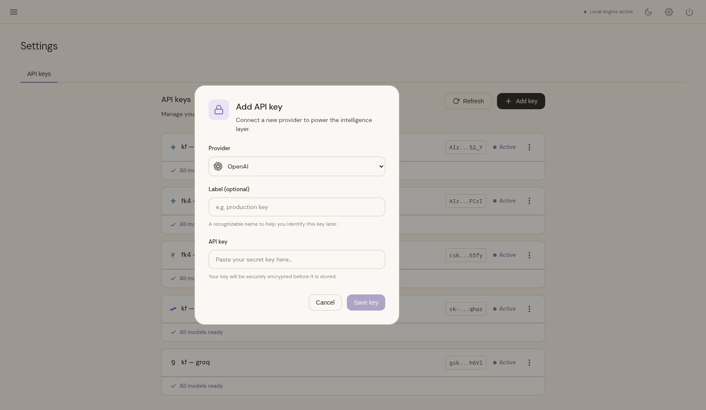

# Configuration & Key Management

Agens segregates its operating settings, memory storage, and secure credentials across three distinct operational boundaries:

1. **Environment Variables**: Low-level engine parameters defined in `settings.py` or `.env`.
2. **User Memories**: Highly dynamic facts stored in `config.json` and deep-merged via agent prompts.
3. **SQLite Database Schema**: Persistent session histories, encrypted keys, calendar events, and settings.

---

## 1. Environment Configuration

Low-level settings are parsed by Pydantic-Settings from environment variables or an `agens.env` file specified by the user:

| Variable | Purpose | Default Value |
| :--- | :--- | :--- |
| `PRODUCTION` | Disables debug logs and optimizes execution verbosity | `True` |
| `DATABASE_URL` | SQLAlchemy-compatible SQLite connection string | `sqlite+aiosqlite:///.agens/db.sqlite` |
| `FERNET_SECRET` | Base64-encoded key used to encrypt provider API keys | Auto-generated on first startup |
| `SESSION_SECRET_KEY` | Hex or random key used to secure active Web UI cookies | Auto-generated on first startup |
| `WORKSPACE_ROOT` | Scopes directory tools to prevent filesystem escape | Current working directory (CWD) |
| `AGENS_ENV_FILE` | Path to an external env configuration file | CWD or `.agens/` |
| `WEB_HOST` | Host address uvicorn binds to | `0.0.0.0` |
| `WEB_PORT` | Port number uvicorn listens on | `8000` |

> [!TIP]
> **Customizing Web Bind Port**: While the web server defaults to port `8000`, you can dynamically override it via environment variables or CLI options when booting the client:
> - Direct CLI parameter: `agens web --port 8080` (or `-p 8080`)
> - Direct environment override: `WEB_PORT=8080 agens web`

---

## 2. Cryptographic API Key Management

Agens treats third-party API credentials (Gemini, OpenAI, DeepSeek, etc.) with strict security. Plaintext API keys are **never** stored on disk or written to plaintext config files.

### Encryption at Rest
At first launch, the engine generates a cryptographic `FERNET_SECRET` key and writes it securely to local configuration.
1. When you add an API key, it is encrypted using `cryptography.fernet` symmetric encryption.
2. The encrypted payload, along with an in-memory hash index, is saved to the SQLite database.
3. Decryption happens **exclusively in-memory** during an active LLM generation request.

### API Key Administration
API keys are easily managed using standard CLI commands:

```bash
agens apikey add    <label> <provider> <api_key>   # Register and encrypt a new key
agens apikey list                                   # Show all registered keys (hints only)
agens apikey remove <label>                         # Permanently delete a key
agens apikey disable <label>                        # Temporarily disable a key from rotation
agens apikey enable  <label>                        # Re-enable a disabled key
```

Alternatively, you can manage your keys dynamically through the Web UI dashboard, which supports adding, viewing, enabling/disabling, and deleting credentials with instant feedback:

<div align="center">
  <p><b>API Keys Dashboard:</b></p>
  
  <p><b>Adding a New Fernet-Encrypted Key:</b></p>
  
</div>

---

## 3. Resilient Key Rotation & Cooldowns

To make sure Agens stays available when using free API keys, it supports automatic provider, model, and key failovers. If you are using free-tier API keys or model fallback options:

1. **Error Interception**: When a provider adapter intercepts a `429 Rate Limit` or quota exhausted error from an API call, it raises an internal `RateLimitError`.
2. **Cooldown Tracking**: The `APIKeyManager` catches this exception and records a timestamped cooldown directly inside the DB `api_keys.model_cooldowns` JSON column:
   - *Rate limits*: Placed on cooldown for `60` seconds by default.
   - *Quota exhaustion*: Placed on cooldown for `24` hours.
3. **In-Flight Stream Recovery & State Preservation**:
   Instead of stopping and losing your work when you hit a rate limit, Agens has a built-in recovery flow:
   - The active ReAct state—including intermediate tool calls, raw arguments, and tool execution results—is tracked dynamically in-memory within `LLMClient.react_stream()` as `working_messages`.
   - When a `RateLimitError` is caught inside the generator loop, the ReAct stream halts and invokes an internal rate-limit recovery callback (`_recover_rate_limit`).
   - The recovery handler rotates to the next available API key, swaps providers, or falls back to another configured model *without* replacing the live `LLMClient` object.
   - It performs an in-place credential swap (`swap_key`) and retries the exact same ReAct iteration seamlessly, yielding status update events to the client interface.
   - This preserves all accumulated `working_messages` context, allowing the engine to resume generating the final answer precisely where it left off, giving the user a smooth, uninterrupted experience.

   ```mermaid
   sequenceDiagram
       participant R as ReAct Loop (react_stream)
       participant C as LLMClient
       participant A as Agent / KeyManager
       participant LLM as LLM Provider (429)

       R->>C: Call ReAct Iteration
       C->>LLM: Stream request
       LLM-->>C: 429 RateLimitError
       C->>A: Trigger on_rate_limit callback
       Note over A: APIKeyManager rotates key<br/>or switches provider
       A->>C: swap_key(new_config)
       A-->>C: Return new model / recovery events
       C-->>R: Yield Switched API Key/Model status
       Note over R: Retry ReAct iteration<br/>preserving working_messages
       R->>C: Retry ReAct Iteration
       C->>LLM: Stream request with new key
       LLM-->>R: Yield token stream & final answer
   ```

---

## 4. Persistent User Memories

Rather than relying on short-term token window contexts, Agens utilizes a long-term dynamic configuration system (`config.json`) to persist user facts:

### Memory Storage Flow
The agent can decide to remember facts about you (e.g. location, coding languages, career goals) by executing the `update_config` tool. This writes directly into the `user.memories` key inside `config.json`:

```json
{
  "user": {
    "memories": {
      "city": "Berlin",
      "specialty": "FastAPI and Svelte",
      "style": "clean, concise, self-contained code"
    }
  }
}
```

### Dynamic Injection
On every single chat interaction, the `prompt_builder.py` module loads these memory keys and dynamically injects them into the LLM's active system prompt, preserving continuity.

### Forgetting Memories
When a user instructs the assistant to "forget" a fact, the agent calls `update_config` with a target key set to `null`. The engine's deep-merge algorithm automatically prunes that key and deletes it from the `config.json` file.

---

## 5. SQLite Database Schema

Agens stores structural operational states in a local single-file SQLite database. Schema transitions are managed dynamically using Alembic migrations:

| Table | Contents |
| :--- | :--- |
| `sessions` | Active conversation thread IDs, summaries, and creation timestamps. |
| `messages` | Chat history records including prompt content, role tags, and tool schemas/results. |
| `api_keys` | Encrypted Fernet strings, provider labels, active/disabled state, and cooldowns. |
| `schedule_events` | Calendar entries, reminders, and user-scheduled alert data. |
| `settings` | Row-level configuration parameters (e.g. global `safety_mode` state). |

Schema upgrades are applied automatically during engine bootstrap, removing the need for manual database updates.

---

## 6. Token Usage Optimization

To help you stay within free-tier limits, Agens is designed to keep token usage low:

1. **Compact Chat History Buffer**:
   The memory manager (`MemoryManager.get_history`) defaults to retrieving only the last `3` messages for conversation history. This highly compact context window prevents exponential token accumulation as chat threads grow longer, keeping token bills at exactly zero.
2. **Modular Dynamic Prompt Injection**:
   Rather than dumping every tool guideline and schema into every single prompt, Agens dynamically checks which tool groups are actively enabled. The `PromptBuilder` only injects guidelines for the *active* tool groups, saving hundreds of context tokens per generation.
3. **Preamble and Redundancy Stripping**:
   The LLM's system-level instructions are optimized to enforce high conciseness. The model is commanded to bypass polite preambles, act only on the latest message, and provide minimal status confirmations, minimizing completion token usage and latency.

---

## Navigation

- 🏠 **[Home (README)](../README.md)**
- 🚀 **[Installation & Setup](installation.md)**
- 🏗️ **[Architecture Deep Dive](architecture.md)**
- 🛠️ **[Tool System & Custom Tools](tools.md)**
- 💻 **[Developer & Contributor Manual](development.md)**
